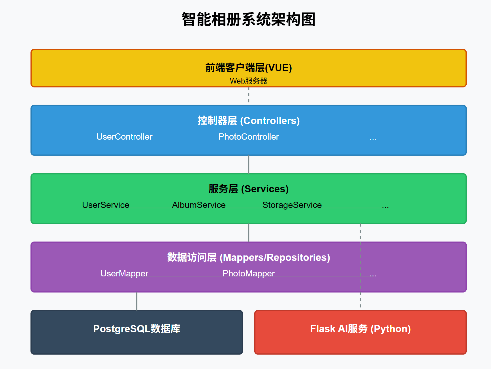
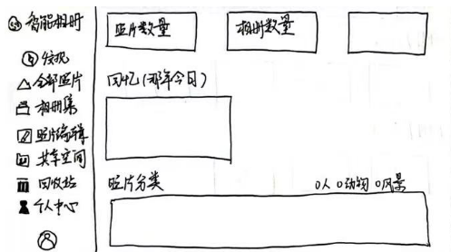
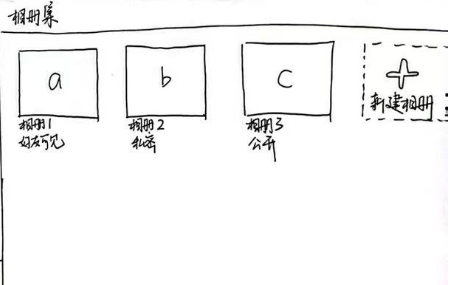
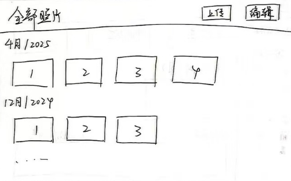
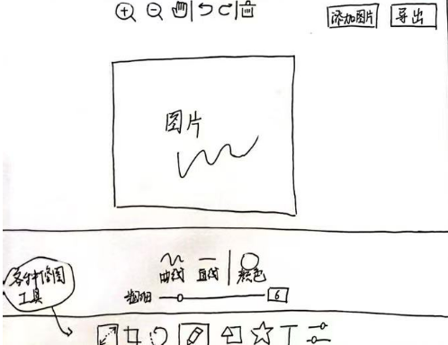
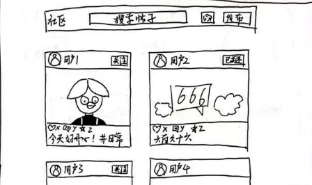
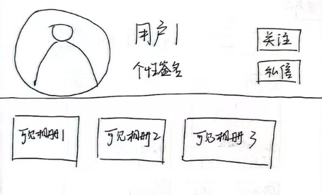

# sprint1 report 

## 架构

智能相册系统采用了多层架构设计，具体包括前端客户端层、控制器层、服务层、数据访问层和数据存储层，此外集成了python写的外部AI服务。

这种分层架构有利于代码的组织和维护，同时保证了系统的可扩展性和灵活性。这也是java前后端开发的经典架构设计。

### 1. 前端客户端层（VUE）

前端客户端层负责与用户进行交互，通过接入后端的接口，将用户操作转换为对后端API的调用。

### 2. 控制器层（Controllers）

控制器层是系统的入口点，负责接收和响应HTTP请求，包含了大部分数据库中数据表的实体的接口。

此外：控制器层使用JWT进行身份验证，并通过ThreadLocal存储用户信息，实现请求上下文的传递。

### 3. 服务层（Services）

服务层包含业务逻辑，为控制器层提供具体的方法。

### 4. 数据访问层（Mappers）

数据访问层负责与数据库的交互，项目使用MyBatis-Plus框架简化数据库操作。

### 5. 数据存储层（sql）

系统使用PostgreSQL数据库存储结构化数据，数据模型设计见album.sql文件。

### 6. 外部AI服务

系统集成了基于Flask的Python AI服务，通过网址访问调用接口，用于ai识别，照片到视频的转换，视频字幕添加等内容。

## 数据流

1. 用户通过前端界面进行操作（如上传照片）
2. 请求首先到达控制器层，控制器验证身份并解析请求
3. 控制器调用相应的服务层组件处理业务逻辑
4. 服务层可能调用数据访问层进行数据操作或调用外部AI服务（FLASK）进行处理
5. 数据访问层与数据库交互，存储或检索数据
6. 结果通过各层传回给前端展示

1. **为什么选择分层架构？**
   - 分离关注点，使代码更易于理解和维护
   - 是JAVA前后端sprinboot开发的经典架构，体系成熟。
   - 便于团队协作，不同开发人员可以专注于不同层次
2. **为什么将AI功能分离为独立服务？**
   - 允许使用Python生态系统中强大的AI和视频处理库
   - AI与java结合困难（如jpython）所以选择FLASK

## 界面设计手稿

1.相册主界面

2.相册集

3.全部照片

4.照片编辑工具

5.社区空间

6.用户主页

